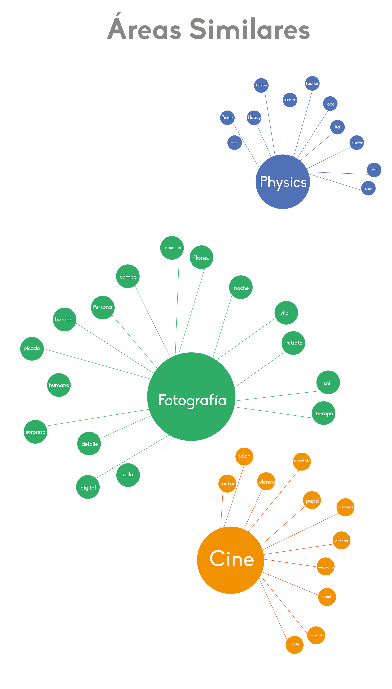
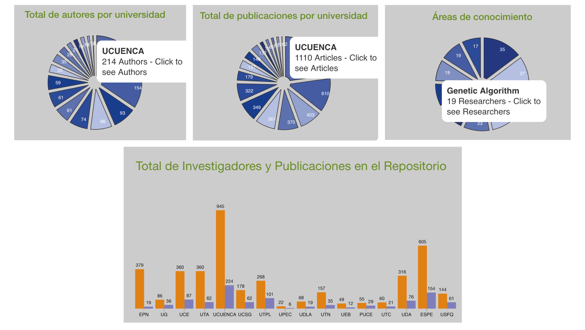
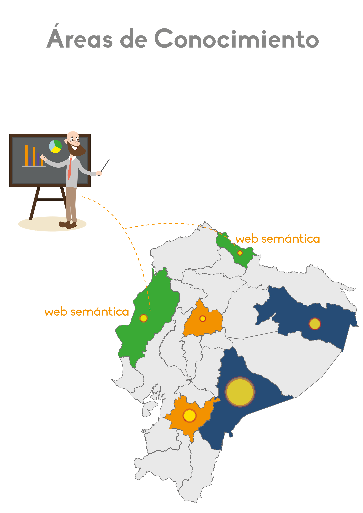

- title : Detecting similar areas of knowledge using Semantic and Data Mining technologies
- description : Thesis presentation in order to obtain the degree of Computer Scientist from the University of Cuenca.
- author : Xavier Sumba
- theme : white
- transition : none

***

### Arquitectura de Plataforma para un Repositorio de Investigadores Ecuatorianos usando minería de datos y tecnologías semánticas.

 
 
##### 
<a style="color: black;" href="http://cuent.tk">Xavier Sumba Toral</a> / <a style="color: black;" href="https://www.facebook.com/FERNANDO2654?fref=ts">Freddy Sumba Orellana</a>

<i>Universidad de Cuenca, Departamento de Ciencias de la Computación, Cuenca, Ecuador.</i>

***

### Introducción

- ¿Quién trabaja en líneas de investigación parecidas?
- ¿Cómo se puede crear una red de investigadores de un área en común, cuando no conocemos si estas existen?
- Obtener sus artículos, conocer revistas en las que fueron aceptados, entre otros.
- Proyectos interinstitucionales.

***

### Problemas comunes

***

### Arquitectura General

***

### Resultados

---

---

---

---

---

### __¿Más?__

***

### Conclusiones

- Procesos como el de desambiguación y etiquetado necesitan un trabajo mas exhaustivo, debido a que aun se tienen ciertas inconsistencias en los resultados.
- Considerar que incluso para una persona es complicado determinar cierta información sobre un investigador o varios investigadores que pueden trabajar en conjunto. Por lo que aun es un reto a nivel computacional.
- Además como resultado se cuenta con un repositorio centralizado y se provee el uso de estos datos a cualquier persona.

***

### Trabajos Futuros
- Mejorar procesos de extracción de datos.
- Incluir el abstract para analizar redes de colaboración.
- Mejorar el proceso de etiquetado.
- Analizar nuevos algoritmos de clustering o otras técnicas para encontrar agrupaciones.

***

<table style="width:100%;">
  <tr>
    <th><h2 style="text-align: center">CLEI 2016</h2></th>
    <th><h2 style="text-align: center">ENTCS</h2></th>
    <th><h2 style="text-align: center">TICAL</h2></th>
  </tr>
  <tr>
    <th style="width: 33%; vertical-align: middle;">
      
    </th>
    <th style="width: 33%; text-align:center; vertical-align: middle;">
      
    </th>
    <th style="width: 33%; text-align:center; vertical-align: middle;">
      
    </th>
  </tr>
</table>

***
### Agradecimientos

***

# ¿PREGUNTAS?
